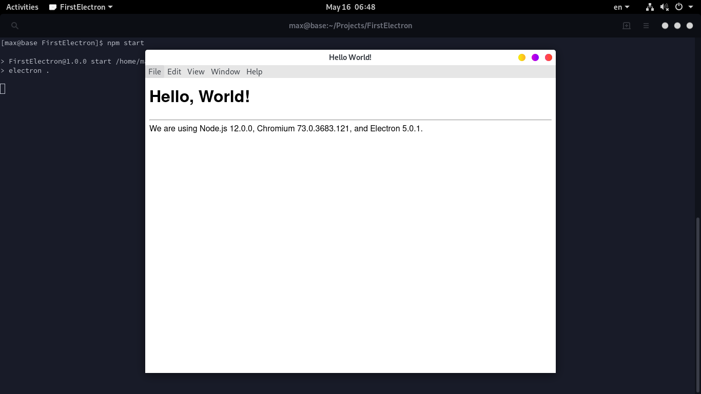
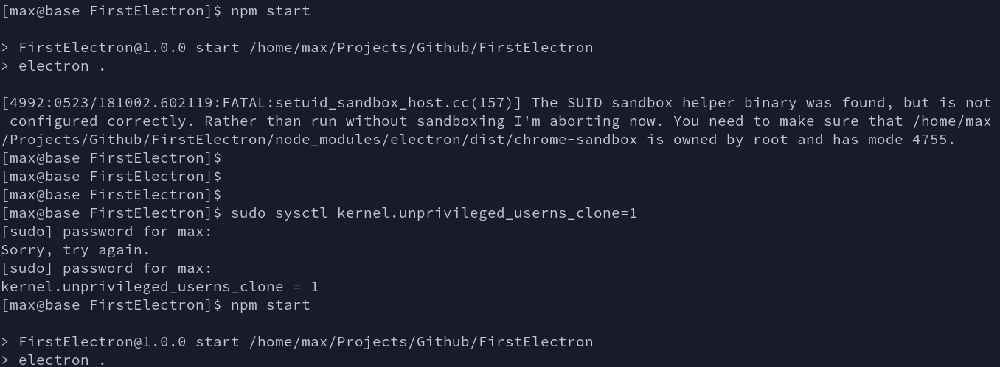

# FirstElectron

Begin point and Getting start of the electron using node js.



## Using

#### `$ npm install`

```

+ electron@5.0.1
added 145 packages from 141 contributors and audited 201 packages in 34.01s
found 0 vulnerabilities

```

#### `$ npm start`

```

> FirstElectron@1.0.0 start /home/max/Projects/FirstElectron
> electron .

```


#### Fun problem



Error :
```
[12345:0516/063318.469566:FATAL:setuid_sandbox_host.cc(157)] The SUID sandbox helper binary was found, but is not configured correctly. Rather than run without sandboxing I'm aborting now. You need to make sure that /home/max/Projects/FirstElectron/node_modules/electron/dist/chrome-sandbox is owned by root and has mode 4755.
```

Solved By :
```sh
[max@base FirstElectron]$ sudo sysctl kernel.unprivileged_userns_clone=1
kernel.unprivileged_userns_clone = 1
```

- https://github.com/electron/electron/issues/17972

- https://github.com/justinribeiro/dockerfiles/issues/40

### Other sample

```sh
$ git clone https://github.com/electron/electron-quick-start
$ cd electron-quick-start
$ npm install
$ npm start
```

### License

FirstElectron is licensed under the [GNU General Public License](LICENSE).
